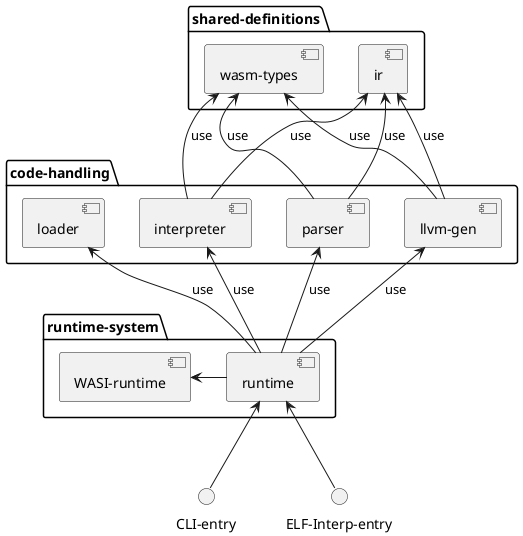

# WASM RT

[](https://gitlab.db.in.tum.de/epd24s/wasm-rt/-/commits/master)
[](https://gitlab.db.in.tum.de/epd24s/wasm-rt/-/commits/master)
[](https://gitlab.db.in.tum.de/epd24s/wasm-rt/-/releases)

## Building

Build Requirements:
 - rustc 1.78.0
 - cargo 1.78.0
 - [LLVM 18.1.6](https://github.com/llvm/llvm-project/releases/tag/llvmorg-18.1.6)

This project uses `cargo` for its project management. Therefore, a development / debug build is created using
```sh
cargo build
```
, and a release build is created using
```sh
cargo build --release
```
. To run the WASM runtime, execute the following command:
```sh
cargo run -r
```

To select a different LLVM version than your system's default, you may set the `LLVM_SYS_180_PREFIX` environment variable.

## Testing

Unit and integration tests are implemented through plain cargo tests, invoked via the following command:
```sh
cargo test
```

To select specific test(s), run
```sh
cargo test --test=<test_suit_name> <test_name>
```

For better debugging output, run tests single-threaded and get the full logging output:
```sh
RUST_LOG=debug cargo test --test=integration_tests -- --nocapture --test-threads=1
```

You may also enable address and memory sanitizers on tests (requires nightly):
```sh
RUSTFLAGS=-Zsanitizer=address cargo +nightly test -Zbuild-std --target x86_64-unknown-linux-gnu --test=integration_tests
RUSTFLAGS="-Zsanitizer=memory -Zsanitizer-memory-track-origins" cargo +nightly test -Zbuild-std --target x86_64-unknown-linux-gnu --test=integration_tests
```

## Fuzzing

To run the fuzzing for our wasm parser:
```sh
cargo install cargo-fuzz
cargo +nightly fuzz run parser_fuzzing
```
Be aware: fuzzing requires a nightly toolchain (`rustup default nightly`)

## Benchmarking

We use Criterion for benchmarks and their statistical analysis. To run all available benchmarks, execute:
```sh
cargo bench
```

There is also an experimental, special cargo subcommand for criterion, which can be invoked like follows:
```sh
cargo install cargo-criterion
cargo criterion
```

## Structure

(if this not rendered automatically for you, consider installing a plantuml diagram renderer extension)


## Documentation

### Runtime Data Structures

Idea:
 - optional global context, used for global optimisations like string and type interning. WIP.
    ~ wasmtime engine
 - `InstanceHandle` => Bundled "view" on resources ressembling a WebAssembly module. Actual owner of resources is the associated cluster.
    ~ "Agent" from the threads proposal
 - `Cluster` => Resource pool that owns all resources associated with module instances.
    ~ "Agent Cluster" from threads proposal
    ~ "Store" from wasmtime
 - `Linker` => Collects and structures imports / dependencies that are not bound to a cluster (e.g. host functions)
 - `BoundLinker` => Collected and structures imports / dependencies of a specific cluster or unbound (e.g. host functions). Linking is only possible between members of a cluster and / or unbound resources.
 - `Engine` => Execution backend, unique per `InstanceHandle`, but owned by `Cluster`.

### LLVM Backend Symbol Naming Scheme

Function name mapping:
 - Function `$func_name` imported with C Calling Convention => `__import__$(func_name)__`
 - Function `$func_name` exported from current module with C Calling Convention => `$(func_name)`
 - Function with `$func_idx` declared for internal usage with internal calling convention => `$(func_idx)`

Globals:
 - Regular wasm global with idx `$global_idx` => `__wasmine_global__$(global_idx)`
 - Reference to execution context of other module `$module_name` for calling of imported functions as closures => `__import_ctxt__$(module_name)__`

### LLVM Calling Conventions and Function Signatures

**All** functions that are accessed from outside the generated code (= exports) use C calling convention with a special signature:
```rust
// Returning Void
fn exported_function(execution_context_ptr: *mut ExecutionContext, parameters_arr_ptr: *const Value) -> ();
// Returning a single wasm value
fn exported_function(execution_context_ptr: *mut ExecutionContext, parameters_arr_ptr: *const Value) -> Value;
// Returning multiple wasm values
fn exported_function(execution_context_ptr: *mut ExecutionContext, parameters_arr_ptr: *const Value, return_values: *mut Value) -> ();
```

All internal function calls use an internal calling convention which might differ from the C calling convention. All parameters are passed as parameters, multiple return values are returned in structs.

Wrapper functions to convert between the different calling conventions and call signatures are automatically generated for all exported and imported functions.

# TODO

 * use new wasictxt to fix sightglass
 * add option to compile llvm to shared library
 * add option to compile via llvm to elf binary where runtime-lib is loaded as interpreter
