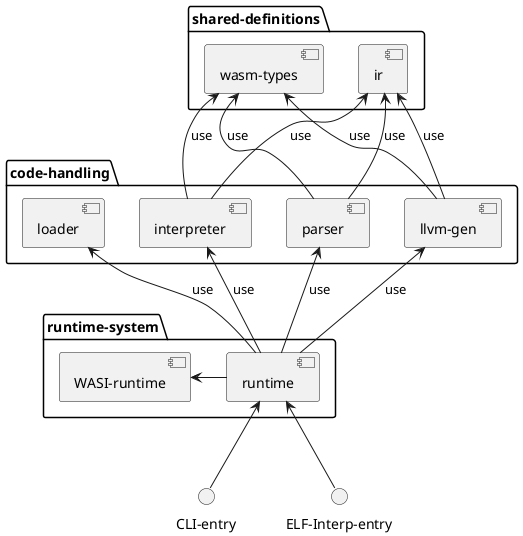
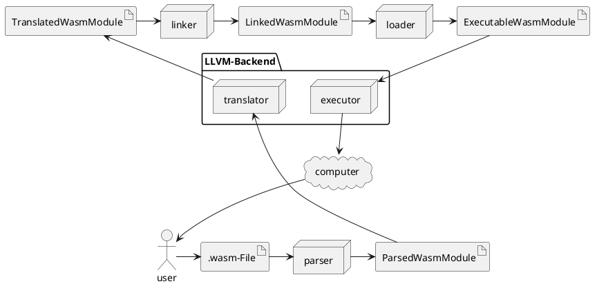

# WASM RT

[](https://gitlab.db.in.tum.de/epd24s/wasm-rt/-/commits/master)
[](https://gitlab.db.in.tum.de/epd24s/wasm-rt/-/commits/master)
[](https://gitlab.db.in.tum.de/epd24s/wasm-rt/-/releases)

## Building

Build Requirements:
 - rustc 1.78.0
 - cargo 1.78.0
 - [LLVM 18.1.6](https://github.com/llvm/llvm-project/releases/tag/llvmorg-18.1.6)

This project uses `cargo` for its project management. Therefore, a development / debug build is created using
```sh
cargo build
```
, and a release build is created using
```sh
cargo build --release
```
. To run the WASM runtime, execute the following command:
```sh
cargo run -r
```

To select a different LLVM version than your system's default, you may set the `LLVM_SYS_180_PREFIX` environment variable.

## Testing

Unit and integration tests are implemented through plain cargo tests, invoked via the following command:
```sh
cargo test
```

To select specific test(s), run
```sh
cargo test --test=<test_suit_name> <test_name>
```

For better debugging output, run tests single-threaded and get the full logging output:
```sh
RUST_LOG=debug cargo test --test=integration_tests -- --nocapture --test-threads=1
```

You may also enable address and memory sanitizers on tests (requires nightly):
```sh
RUSTFLAGS=-Zsanitizer=address cargo +nightly test -Zbuild-std --target x86_64-unknown-linux-gnu --test=integration_tests
RUSTFLAGS="-Zsanitizer=memory -Zsanitizer-memory-track-origins" cargo +nightly test -Zbuild-std --target x86_64-unknown-linux-gnu --test=integration_tests
```

## Fuzzing

To run the fuzzing for our wasm parser:
```sh
cargo install cargo-fuzz
cargo +nightly fuzz run parser_fuzzing
```
Be aware: fuzzing requires a nightly toolchain (`rustup default nightly`)

## Benchmarking

We use Criterion for benchmarks and their statistical analysis. To run all available benchmarks, execute:
```sh
cargo bench
```

There is also an experimental, special cargo subcommand for criterion, which can be invoked like follows:
```sh
cargo install cargo-criterion
cargo criterion
```

## Structure

(if this not rendered automatically for you, consider installing a plantuml diagram renderer extension)




Idee:
 - (optional) Globaler Context wie wasmtime engine, v.a. für globale optimierungen wie Type Interning / String Interning, etc. => zunächst in einer VM
 - Linker = Conveniance für Registrieren von Objekten, die extern von Wasm sind (e.g. host functions)
 - BoundLinker = Linker der nur noch auf einem Cluster arbeiten kann => kann auch imports von anderen modulen verarbeiten
 - Cluster = Bündel an Modulinstanzen die sich gegenseitig inkludieren können = Resource Pool = "Agent Cluster" = Wasmtime Store
 - Instance = WasmModuleInstance = fertig geladenes, ausführbereits Wasm modul = "Agent"
 - Engine = Execution Backend, Unique pro Instanz
