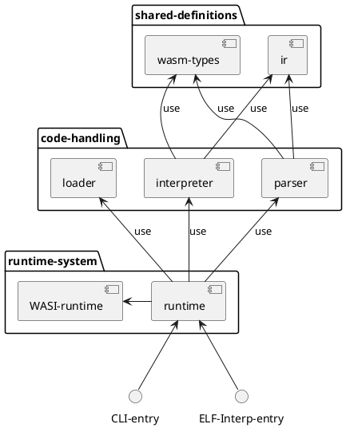

# WASM RT

[](https://gitlab.db.in.tum.de/epd24s/wasm-rt/-/commits/master)
[](https://gitlab.db.in.tum.de/epd24s/wasm-rt/-/commits/master)
[](https://gitlab.db.in.tum.de/epd24s/wasm-rt/-/releases)

## Building

This project uses `cargo` for its project management. Therefore, a development / debug build is created using
```sh
cargo build
```
, and a release build is created using
```sh
cargo build --release
```
. To run the WASM runtime, execute the following command:
```sh
cargo run -r
```

## Testing

Unit and integration tests are implemented through plain cargo tests, invoked via the following command:
```sh
cargo test
```

To select specific test(s), run
```sh
cargo test --test=<test_suit_name> <test_name>
```

## Fuzzing

To run the fuzzing for our wasm parser:
```sh
cargo install cargo-fuzz
cargo +nightly fuzz run parser_fuzzing
```
Be aware: fuzzing requires a nightly toolchain (`rustup default nightly`)

## Benchmarking

We use Criterion for benchmarks and their statistical analysis. To run all available benchmarks, execute:
```sh
cargo bench
```

There is also an experimental, special cargo subcommand for criterion, which can be invoked like follows:
```sh
cargo install cargo-criterion
cargo criterion
```

## Structure

(if this not rendered automatically for you, consider installing a plantuml diagram renderer extension)

